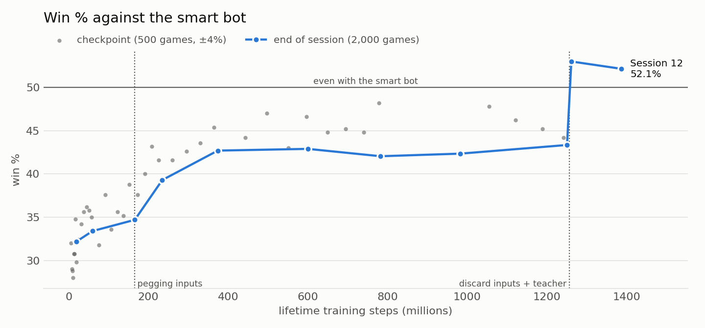

# Cribbage_ML

A reinforcement-learning agent that plays full two-player cribbage to 121, discards, pegging,
counting and all, and **wins 54% of its games against a strong heuristic bot** (2,000 seeded
games, ±2.2%). You can play against it in the terminal.

<picture>
  <source media="(prefers-color-scheme: dark)" srcset="docs/win_rate_dark.png">
  
</picture>

## Play against it

You need Python 3.11 or 3.12 and git. The trained model ships in `models/release/`.
```
git clone https://github.com/Wwaallker/Cribbage_ML-public.git
cd Cribbage_ML-public
python3 -m venv .venv
source .venv/bin/activate            # Windows: .venv\Scripts\activate
pip install torch==2.10.0 --index-url https://download.pytorch.org/whl/cpu   # Windows/Linux; skip on Mac
pip install -r requirements.txt
python hud.py                        # then [1] Play vs AI
```
Install the CPU-only PyTorch first, as above. A plain `pip install -r requirements.txt` pulls the
GPU build, which brings about 5 GB of NVIDIA libraries the game never uses.

- Type cards as rank + suit: `5H`, `TC` or `10D`, `QS`. Discard two at once: `5H TC`.
- `tab` shows or hides the AI's hand, `menu` goes back, `quit` exits.
- Make the terminal tall (about 40 lines) so the whole table fits. On Windows, use Windows Terminal.
- Each game has a seed key (shown at the top, e.g. `K7QM2XPA`). Type a key at the start to get
  the same deals again. Every move is saved to `replays/<KEY>.json`, and
  `python -m tools.replay_game replays/<KEY>.json --upto <move>` rebuilds the position just
  before that move: handy for reporting a bug.

## How it works

- **The agent:** MaskablePPO from [sb3-contrib](https://github.com/Stable-Baselines-Team/stable-baselines3-contrib),
  two 256×256 networks (policy and value), illegal moves masked out. The reward is ±1 for
  winning or losing the game, plus 0.05 for each point it scores and −0.05 for each point the
  opponent scores.
- **The opponent ("smart" bot):** a hand-written heuristic. It discards by the value of the kept
  four cards plus pairs and fifteens for the crib, and pegs with a 2-ply lookahead (points now,
  minus the opponent's best expected reply). It is a solid club player, not an expert.
- **What the agent sees:** 575 numbers: its cards, the play so far, the scores, and two kinds of
  help described below.
- **What it can do:** 67 actions: play one of 52 cards while pegging, or discard one of the 15
  pairs from its six cards.

## What made the difference

| Step | Training steps | Win % vs the bot |
| --- | --- | --- |
| First version: discards one card at a time | 680M | ~39% |
| Discard both cards as one decision, bigger network | 168M | 34.7% |
| **Pegging inputs**: points each play scores now, and the opponent's best reply | 237M | 39.3% |
| More PPO: a long plateau | 1.25B | 43.4% |
| **Discard teacher**: supervised training on the best discards | 1.25B | 46.6% |
| **Discard-value inputs** + the teacher (this release) | 1.26B | **54.0%** |

The big gains did not come from more training. PPO sat at 42–44% for 900M steps. Splitting the
points by source showed why: the agent was level at pegging and in the crib, but lost about 0.4
points a deal on the hand it kept, which is the whole losing margin over a game.

- **PPO struggles with discards.** A good throw is worth about half a point; the cut card and the
  pegging swing a deal by ten. The reward for one decision is buried in a whole game of luck.
- **Measure the ceiling first.** Before building anything, the same model was replayed on the
  same games with only its discards swapped for the best ones: 46.5% → 54.1%. That showed the prize.
- **Hand the network what it cannot compute.** Valuing a discard means averaging the kept hand over
  all 46 possible cut cards, plus the crib. The network now gets that value for each of its 15
  discards as inputs, and `tools/discard_teacher.py` trains it to use them, while a penalty keeps
  its pegging unchanged. Discard loss fell from 0.69 to 0.02 points a deal; the bot loses 0.38.
- **Watch what the loss can see.** The first teacher loss (expected points given up) gives no push
  at all to a discard the network rates at 0%, so the best throw was never found. Adding a soft
  cross-entropy term, which pushes hardest on exactly those, took discards from 0.28 to 0.02 points lost.

The pegging inputs earlier were the same idea: give the network the result of a calculation it
would otherwise have to discover.

## Train it yourself

Run everything from the repo root:
```
python train.py --hours 2       # train (resumes models/current.zip, or starts fresh)
python evaluate.py              # win % over 2000 fixed, seeded games
python metrics.py               # win/skunk rates, points by source, discard quality
python -m tools.discard_teacher models/current models/taught --epochs 40 --soft-ce 0.25 --peg-weight 20
python train.py --hours 6 --opponent pool     # self-play, see Roadmap
python hud.py                   # menu + live training dashboard
python -m tests.test_env        # likewise tests.test_discard, tests.test_pegging
```
Each session ends with a 2,000-game evaluation and full metrics (`--metrics-games 0` skips the
metrics). If an [Obsidian](https://obsidian.md) vault exists at `../Cribbage_ML` (or
`CRIBBAGE_VAULT`), it also writes a note for the session and redraws charts there
(`tools/session_note.py`, `tools/vault_charts.py`).

### Rust engine (optional, about 1.5× faster training)
`rust/` holds the game engine of `cribbage/env.py` (rules, scoring, the heuristic opponent,
observation and masks) in Rust. It plays exactly the same games: it carries a copy of Python's
random number generator, so a seeded game goes move for move as on the Python engine, and
`tests/test_rust_engine.py` checks that. Python stays the reference: change the rules in `env.py`
first, then in `rust/src/`.
```
pip install maturin
(cd rust && maturin develop --release)          # needs cargo / rustc 1.74+
CRIBBAGE_ENGINE=rust python train.py --hours 2  # likewise evaluate.py, metrics.py
python -m tests.test_rust_engine                # after any change to either engine
```
`play.py` always uses the Python engine, since it swaps the computer's moves for yours.

## Layout
```
cribbage/          game package
  env.py           CribbageEnv: rules, scoring, heuristic opponent, observation/actions
  rust_env.py      the same env with the game engine in Rust
  crib_table.json  average crib points for each kind of 2-card throw
  ui.py, board.py  terminal drawing and the animated board replay
train.py           train in timed sessions; evaluates and measures at the end
evaluate.py        win % over 2000 fixed, seeded games
metrics.py         win/skunk rates, points by source, discard quality
play.py, hud.py    play against the AI; menu + live training dashboard
rust/              the Rust game engine (PyO3 module cribbage_rs)
tools/             discard_teacher.py, grow_obs.py (grow a model to a bigger observation),
                   export_opponent.py (a model as a self-play opponent), replay_game.py,
                   bench_engine.py, session_note.py, vault_charts.py
tests/             env sanity, discard and pegging heuristics, Rust vs Python engine
models/release/    cribbage_ai.zip, the model play.py uses
```

## Actions and observation
- Actions 0–51 play that card while pegging; 52–66 discard one of the 15 pairs of hand slots
  (the hand is kept sorted by rank, then suit), so the crib discard is a single decision.
- The observation (575 values) is described block by block in `OBS_BLOCKS` in `cribbage/env.py`.
  `peg_now` and `peg_reply` help with pegging: for each card the AI could play, the points it
  scores now and the expected points of the opponent's best reply. `discard_value` helps with
  the crib discard: for each of the 15 discards, how close it comes to the best one, as
  1 / (1 + points lost / 0.5).
- New observation blocks go at the end. `python -m tools.grow_obs <old> <new>` then grows a saved
  model to fit, with zero weights on the new inputs, so it keeps everything it has learned.

## Roadmap
- **Self-play** (`train.py --opponent pool`, running now). Half the games against the heuristic,
  half against a pool of networks: the frozen 54% model and recent snapshots of itself. The real
  test is the win rate against the frozen 54% model, not against the heuristic.
- **Keep the discards taught.** Long PPO runs slowly loosen them (0.02 → 0.11 points lost a deal
  in six hours); re-running the teacher takes four minutes.
- **A pegging ceiling test.** Swap in a deeper pegging search and replay the same games, to see
  whether pegging is worth the next round of work.
- **Discards that know the situation.** The teacher counts points only; it ignores how the kept
  cards peg and the score near 121.

## License
MIT. See [LICENSE](LICENSE).
